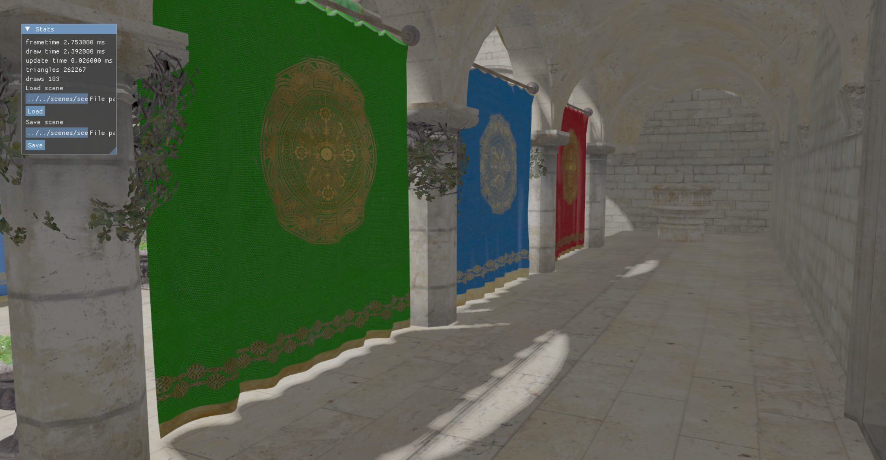
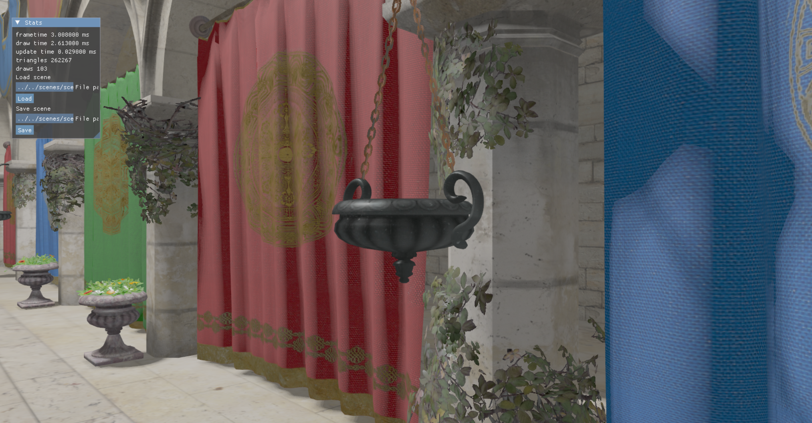
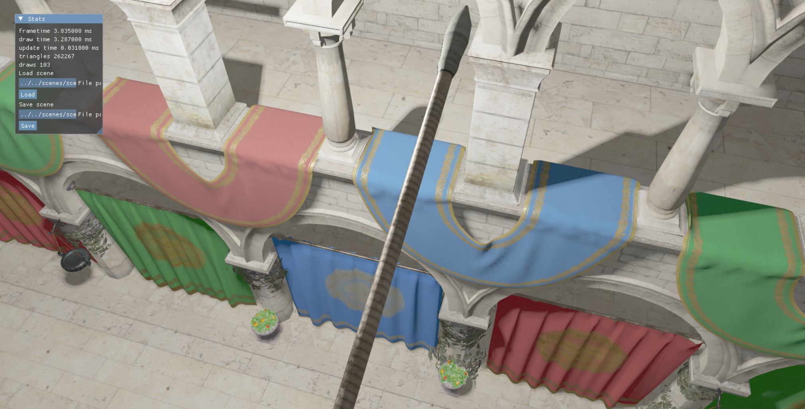

# Vulkan-Based Real-Time 3D Renderer

Welcome to the repository for my Vulkan-based real-time 3D renderer! This project showcases a high-performance rendering engine developed using C++ and Vulkan, featuring advanced techniques such as GLTF model loading, Physically-Based Rendering (PBR), and omnidirectional shadow mapping. Below is an overview of the project's capabilities and how to get started.

## Features

- **GLTF Model Loading**: Supports loading of complex 3D models using the GLTF format.
- **Physically-Based Rendering (PBR)**: Implements PBR for realistic material and lighting interactions, including support for metallic and roughness maps.
- **Scene Management System**: Custom-built system for handling multiple objects, cameras, and scene states.
- **Omnidirectional Shadow Mapping**: Realistic shadow mapping using shadow cubes, for dynamic point lights.
- **Lighting Models**: Supports directional, point, and spotlight lighting, with real-time shadow rendering.
- **Shader Programming**: Custom GLSL shaders for vertex, fragment, and lighting effects.

## Demo

**Shadows**



**PBR 1**



**PBR 2**



## Getting Started

### Prerequisites

Ensure that you have the following installed:

- **Vulkan SDK**: [Download here](https://vulkan.lunarg.com/)
- **C++ Compiler**: Compatible with C++17 or higher.

### Building the Project

1. Clone the repository:

    ```bash
    git clone https://github.com/massanaRoger/vulkan-engine.git
    cd vulkan-engine
    ```

2. Create a build directory and navigate to it:

    ```bash
    mkdir build && cd build
    ```

3. Run CMake to generate the build files:

    ```bash
    cmake ..
    ```

4. Compile the project:

    ```bash
    make
    ```

### Running the Renderer

1. After a successful build, you can run the renderer from the build directory:

    ```bash
    ./engine
    ```

2. Ensure you have the required 3D models in the appropriate folder. By default, the engine expects models in the `assets/models/` directory.

3. Controls

- F1 to toggle cursor / camera movement
- Click on load to load the sample scene

## Future Improvements

- Implement **Deferred Shading** to optimize rendering of complex scenes.
- Add support for **skeletal animation** to handle animated models.
- Explore **Compute Shaders** for particle effects and post-processing.

## Contact

If you have any questions or feedback, feel free to reach out!

- **LinkedIn**: [Roger Massana](https://linkedin.com/in/rogermassanalopez)
- **Email**: rogermassana2002@gmail.com
